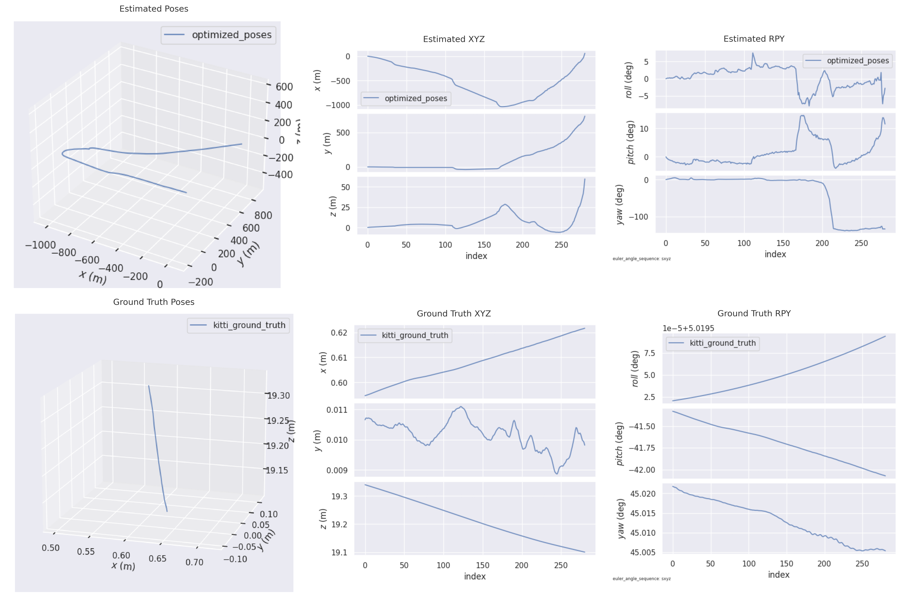

# README
Fast-LIO2 + SC-SLAM

## My RUN EXPERIMENTS
Skip Fast-LIO2-ROS PART
### Bug Recording
#### 1. Crashes when rosdep update
```bash 
rosdep update
```
Then it occurs:
```bash
cxx@cxx-Precision-3660:~/Fast-LIO2_SC-SLAM/ros_ws/src$ rosdep update

reading in sources list data from /etc/ros/rosdep/sources.list.d
ERROR: unable to process source [https://raw.githubusercontent.com/ros/rosdistro/master/rosdep/osx-homebrew.yaml]:
	<urlopen error EOF occurred in violation of protocol (_ssl.c:1145)> (https://raw.githubusercontent.com/ros/rosdistro/master/rosdep/osx-homebrew.yaml)
Hit https://raw.githubusercontent.com/ros/rosdistro/master/rosdep/base.yaml
Hit https://raw.githubusercontent.com/ros/rosdistro/master/rosdep/python.yaml
ERROR: unable to process source [https://raw.githubusercontent.com/ros/rosdistro/master/rosdep/ruby.yaml]:
	<urlopen error EOF occurred in violation of protocol (_ssl.c:1145)> (https://raw.githubusercontent.com/ros/rosdistro/master/rosdep/ruby.yaml)
Hit https://raw.githubusercontent.com/ros/rosdistro/master/releases/fuerte.yaml
Query rosdistro index https://raw.githubusercontent.com/ros/rosdistro/master/index-v4.yaml
Skip end-of-life distro "ardent"
Skip end-of-life distro "bouncy"
Skip end-of-life distro "crystal"
Skip end-of-life distro "dashing"
Skip end-of-life distro "eloquent"
Skip end-of-life distro "foxy"
Skip end-of-life distro "galactic"
Skip end-of-life distro "groovy"
Add distro "humble"
Skip end-of-life distro "hydro"
Skip end-of-life distro "indigo"
Skip end-of-life distro "iron"
Skip end-of-life distro "jade"
Add distro "jazzy"
ERROR: error loading sources list:
	<urlopen error <urlopen error EOF occurred in violation of protocol (_ssl.c:1145)> (https://raw.githubusercontent.com/ros/rosdistro/master/jazzy/distribution.yaml)>
```
Follow and annotate:

```bash
sudo gedit /etc/ros/rosdep/sources.list.d/20-default.list
# yaml https://raw.githubusercontent.com/ros/rosdistro/master/rosdep/ruby.yaml
```
Then `rosdep update`.
#### 2. Crash when build SC-PGO (aloam_velodyne)
```bash
cxx@cxx-Precision-3660:~/Fast-LIO2_SC-SLAM/ros_ws$ colcon build

Starting >>> livox_ros_driver2
Starting >>> Livox-SDK2
Starting >>> aloam_velodyne
Finished <<< Livox-SDK2 [0.13s]                                                                          
Finished <<< livox_ros_driver2 [0.25s]                                                                
Starting >>> fast_lio
--- stderr: aloam_velodyne                                                                        
In file included from /usr/local/include/gtsam/base/Matrix.h:28,
                 from /usr/local/include/gtsam/base/Manifold.h:22,
                 from /usr/local/include/gtsam/base/GenericValue.h:22,
                 from /usr/local/include/gtsam/nonlinear/Values.h:29,
                 from /home/cxx/Fast-LIO2_SC-SLAM/ros_ws/src/SC-PGO/src/laserPosegraphOptimization.cpp:46:
/usr/local/include/gtsam/base/Vector.h:76:52: error: static assertion failed: Error: GTSAM was built against a different version of Eigen
   76 |     GTSAM_EIGEN_VERSION_WORLD==EIGEN_WORLD_VERSION &&
      |                                                    ^
make[2]: *** [CMakeFiles/alaserPGO.dir/build.make:63：CMakeFiles/alaserPGO.dir/src/laserPosegraphOptimization.cpp.o] 错误 1
make[1]: *** [CMakeFiles/Makefile2:84：CMakeFiles/alaserPGO.dir/all] 错误 2
make: *** [Makefile:141：all] 错误 2
---
Failed   <<< aloam_velodyne [18.2s, exited with code 2]
Aborted  <<< fast_lio [21.3s]                                 

Summary: 2 packages finished [21.7s]
  1 package failed: aloam_velodyne
  1 package aborted: fast_lio
  2 packages had stderr output: aloam_velodyne fast_lio
```
The version of eigen is not match in `gtsam` and system.
Download 4.2.0 GTSAM and build.

Other errors:
```bash
In file included from /usr/local/include/eigen3/Eigen/Eigenvalues:36,
                 from /usr/local/include/eigen3/Eigen/Dense:7,
                 from /home/cxx/Fast-LIO2_SC-SLAM/ros_ws/src/SC-PGO/src/laserOdometry.cpp:51:
/usr/local/include/eigen3/Eigen/src/Eigenvalues/Tridiagonalization.h:550:5: error: ‘EIGEN_CONSTEXPR’ does not name a type; did you mean ‘EIGEN_HAS_CONSTEXPR’?
  550 |     EIGEN_CONSTEXPR Index rows() const EIGEN_NOEXCEPT { return m_matrix.rows(); }
      |     ^~~~~~~~~~~~~~~
      |     EIGEN_HAS_CONSTEXPR
/usr/local/include/eigen3/Eigen/src/Eigenvalues/Tridiagonalization.h:551:5: error: ‘EIGEN_CONSTEXPR’ does not name a type; did you mean ‘EIGEN_HAS_CONSTEXPR’?
  551 |     EIGEN_CONSTEXPR Index cols() const EIGEN_NOEXCEPT { return m_matrix.cols(); }
      |     ^~~~~~~~~~~~~~~
      |     EIGEN_HAS_CONSTEXPR
In file included from /usr/local/include/eigen3/Eigen/Eigenvalues:36,
                 from /usr/local/include/eigen3/Eigen/Dense:7,
                 from /home/cxx/Fast-LIO2_SC-SLAM/ros_ws/src/SC-PGO/src/laserMapping.cpp:54:
/usr/local/include/eigen3/Eigen/src/Eigenvalues/Tridiagonalization.h:550:5: error: ‘EIGEN_CONSTEXPR’ does not name a type; did you mean ‘EIGEN_HAS_CONSTEXPR’?
  550 |     EIGEN_CONSTEXPR Index rows() const EIGEN_NOEXCEPT { return m_matrix.rows(); }
      |     ^~~~~~~~~~~~~~~
      |     EIGEN_HAS_CONSTEXPR
```
Focus on laserMapping.cpp, laserOdometry.cpp. So remove their build from CMakeList.txt.
#### 3. Code in Fast-LIO2 `src/laserMapping.cpp` 945:18
```bash
home/cxx/Fast-LIO2_SC-SLAM/ros_ws/src/FAST_LIO/src/laserMapping.cpp:945:181:   required from here
/opt/ros/foxy/include/rclcpp/create_service.hpp:43:3: error: no matching function for call to ‘rclcpp::AnyServiceCallback<std_srvs::srv::Trigger>::set(std::_Bind<void (LaserMappingNode::*(LaserMappingNode*, std::_Placeholder<1>, std::_Placeholder<2>))(std::shared_ptr<const std_srvs::srv::Trigger_Request_<std::allocator<void> > >, std::shared_ptr<std_srvs::srv::Trigger_Response_<std::allocator<void> > >)>)’
   43 |   any_service_callback.set(std::forward<CallbackT>(callback));
      |   ^~~~~~~~~~~~~~~~~~~~
In file included from /opt/ros/foxy/include/rclcpp/service.hpp:28,
                 from /opt/ros/foxy/include/rclcpp/callback_group.hpp:25,
                 from /opt/ros/foxy/include/rclcpp/any_executable.hpp:20,
                 from /opt/ros/foxy/include/rclcpp/memory_strategy.hpp:24,
                 from /opt/ros/foxy/include/rclcpp/memory_strategies.hpp:18,
                 from /opt/ros/foxy/include/rclcpp/executor_options.hpp:20,
                 from /opt/ros/foxy/include/rclcpp/executor.hpp:33,
                 from /opt/ros/foxy/include/rclcpp/executors/multi_threaded_executor.hpp:26,
                 from /opt/ros/foxy/include/rclcpp/executors.hpp:21,
                 from /opt/ros/foxy/include/rclcpp/rclcpp.hpp:146,
                 from /home/cxx/Fast-LIO2_SC-SLAM/ros_ws/src/FAST_LIO/src/laserMapping.cpp:45:
/opt/ros/foxy/include/rclcpp/any_service_callback.hpp:67:8: note: candidate: ‘template<class CallbackT, typename std::enable_if<rclcpp::function_traits::same_arguments<CallbackT, std::function<void(std::shared_ptr<std_srvs::srv::Trigger_Request_<std::allocator<void> > >, std::shared_ptr<std_srvs::srv::Trigger_Response_<std::allocator<void> > >)> >::value, void>::type* <anonymous> > void rclcpp::AnyServiceCallback<ServiceT>::set(CallbackT) [with CallbackT = CallbackT; typename std::enable_if<rclcpp::function_traits::same_arguments<CallbackT, std::function<void(std::shared_ptr<typename ServiceT::Request>, std::shared_ptr<typename ServiceT::Response>)> >::value>::type* <anonymous> = <enumerator>; ServiceT = std_srvs::srv::Trigger]’
   67 |   void set(CallbackT callback)
      |        ^~~
/opt/ros/foxy/include/rclcpp/any_service_callback.hpp:67:8: note:   template argument deduction/substitution failed:
/opt/ros/foxy/include/rclcpp/any_service_callback.hpp:65:17: error: no type named ‘type’ in ‘struct std::enable_if<false, void>’
   65 |     >::type * = nullptr
      |                 ^~~~~~~
/opt/ros/foxy/include/rclcpp/any_service_callback.hpp:81:8: note: candidate: ‘template<class CallbackT, typename std::enable_if<rclcpp::function_traits::same_arguments<CallbackT, std::function<void(std::shared_ptr<rmw_request_id_t>, std::shared_ptr<std_srvs::srv::Trigger_Request_<std::allocator<void> > >, std::shared_ptr<std_srvs::srv::Trigger_Response_<std::allocator<void> > >)> >::value, void>::type* <anonymous> > void rclcpp::AnyServiceCallback<ServiceT>::set(CallbackT) [with CallbackT = CallbackT; typename std::enable_if<rclcpp::function_traits::same_arguments<CallbackT, std::function<void(std::shared_ptr<rmw_request_id_t>, std::shared_ptr<typename ServiceT::Request>, std::shared_ptr<typename ServiceT::Response>)> >::value>::type* <anonymous> = <enumerator>; ServiceT = std_srvs::srv::Trigger]’
   81 |   void set(CallbackT callback)
      |        ^~~
/opt/ros/foxy/include/rclcpp/any_service_callback.hpp:81:8: note:   template argument deduction/substitution failed:
/opt/ros/foxy/include/rclcpp/any_service_callback.hpp:79:17: error: no type named ‘type’ in ‘struct std::enable_if<false, void>’
   79 |     >::type * = nullptr
      |                 ^~~~~~~
make[2]: *** [CMakeFiles/fastlio_mapping.dir/build.make:63：CMakeFiles/fastlio_mapping.dir/src/laserMapping.cpp.o] 错误 1
make[1]: *** [CMakeFiles/Makefile2:124：CMakeFiles/fastlio_mapping.dir/all] 错误 2
make: *** [Makefile:141：all] 错误 2
---
Failed   <<< fast_lio [19.0s, exited with code 2]

Summary: 0 packages finished [19.2s]
  1 package failed: fast_lio
  1 package had stderr output: fast_lio
```
Use replaced contents in 945 line:
```bash
map_save_srv_ = this->create_service<std_srvs::srv::Trigger>(
    "map_save", 
    [this](const std::shared_ptr<std_srvs::srv::Trigger_Request> request, 
           std::shared_ptr<std_srvs::srv::Trigger_Response> response)
    {
        this->map_save_callback(request, response); 
    }
);
```


### Build SC-PGO & Fast-LIO2

1.install `ceres`:
```bash 
sudo apt update
sudo apt install libceres-dev
```

2.build `gtsam` library for `GTSAM`

Download 4.2.0 GTSAM tar.gz from https://github.com/borglab/gtsam/tags
```bash
cd gtsam
mkdir build
cd build
cmake ..
make -j$(nproc)
sudo make install
```
Default version uses 3.3.7 `eigen`.

3.build 3.4.0 `eigen` (optional)
```bash
wget https://gitlab.com/libeigen/eigen/-/archive/3.4.0/eigen-3.4.0.tar.gz
tar -xzvf eigen-3.4.0.tar.gz
cd eigen-3.4.0
mkdir build
cd build
cmake ..
make -j$(nproc)
sudo make install
```
Because default eigen is 3.3.7 from apt-install, you can use 3.4.0 eigen from downloading tar.gz.
Use ```find /usr -name 'Eigen'``` to check Eigen location.

4.Edit CMakeList.txt in SC-PGO folder
```bash
# add_executable(ascanRegistration src/scanRegistration.cpp)
# ament_target_dependencies(ascanRegistration rclcpp rclpy std_msgs geometry_msgs nav_msgs sensor_msgs)
# target_link_libraries(ascanRegistration ${PCL_LIBRARIES})

# add_executable(alaserOdometry src/laserOdometry.cpp)
# ament_target_dependencies(alaserOdometry rclcpp rclpy std_msgs geometry_msgs nav_msgs sensor_msgs)
# target_link_libraries(alaserOdometry ${PCL_LIBRARIES} ${CERES_LIBRARIES})

# add_executable(alaserMapping src/laserMapping.cpp)
# ament_target_dependencies(alaserMapping rclcpp rclpy std_msgs geometry_msgs nav_msgs sensor_msgs tf2 tf2_ros)
# target_link_libraries(alaserMapping ${PCL_LIBRARIES} ${CERES_LIBRARIES})
```
Run and test:
```bash
colcon build --symlink-install --packages-select aloam_velodyne --cmake-clean-cache
```
Then it occurs these, it succeeds:
```bash
Starting >>> aloam_velodyne
[Processing: aloam_velodyne]                             
--- stderr: aloam_velodyne                                
** WARNING ** io features related to openni will be disabled
** WARNING ** io features related to openni2 will be disabled
** WARNING ** io features related to pcap will be disabled
** WARNING ** io features related to png will be disabled
** WARNING ** io features related to libusb-1.0 will be disabled
** WARNING ** visualization features related to openni will be disabled
** WARNING ** visualization features related to openni2 will be disabled
** WARNING ** apps features related to openni will be disabled
/home/cxx/Fast-LIO2_SC-SLAM/ros_ws/src/SC-PGO/include/scancontext/Scancontext.cpp: In function ‘float xy2theta(const float&, const float&)’:
/home/cxx/Fast-LIO2_SC-SLAM/ros_ws/src/SC-PGO/include/scancontext/Scancontext.cpp:36:1: warning: control reaches end of non-void function [-Wreturn-type]
   36 | } // xy2theta
      | ^
/home/cxx/Fast-LIO2_SC-SLAM/ros_ws/src/SC-PGO/src/laserPosegraphOptimization.cpp: In function ‘int main(int, char**)’:
/home/cxx/Fast-LIO2_SC-SLAM/ros_ws/src/SC-PGO/src/laserPosegraphOptimization.cpp:809:10: warning: variable ‘unused’ set but not used [-Wunused-but-set-variable]
  809 |     auto unused = system((std::string("exec rm -r ") + pgScansDirectory).c_str());
      |          ^~~~~~
---
Finished <<< aloam_velodyne [48.6s]

Summary: 1 package finished [48.8s]
  1 package had stderr output: aloam_velodyne
```
5.Build All packages in `ros_ws`(workspace)
```bash
colcon build --symlink-install
```
or
```bash
colcon build --packages-select XXX
```
Success messages like these, you can run the launch files.
```bash
cxx@cxx-Precision-3660:~/Fast-LIO2_SC-SLAM/ros_ws$ colcon build --symlink-install

Starting >>> livox_ros_driver2
Starting >>> Livox-SDK2
Starting >>> aloam_velodyne
Finished <<< Livox-SDK2 [0.10s]                                                                       
Finished <<< aloam_velodyne [0.10s]
Finished <<< livox_ros_driver2 [0.22s]                  
Starting >>> fast_lio
Finished <<< fast_lio [0.22s]  

Summary: 4 packages finished [0.62s]
```

### Run Testing cases
1.Download testing examples map

- KAIST 03 sequence of MulRan dataset
- Riverisde02 pcd map made by FAST-LIO-SLAM

2.Run launch files

It gives ROS1 xml, but we use ROS2, it needs to be converted to py files.

First, add these into CMakeList.txt in SC-PGO, to install launch files in `<ros_ws>/src/SC-PGO/launch` to `<ros_ws>/install/aloam_velodyne/shared/aloam_velodyne/launch`:
```bash
install(DIRECTORY
    ${CMAKE_SOURCE_DIR}/launch
    DESTINATION share/aloam_velodyne/launch)
```
Then, create these py files in launch folder:
`fastlio_ouster64.launch` =>  `launcher.py`
```python
import os
from launch import LaunchDescription
from launch_ros.actions import Node
from ament_index_python.packages import get_package_share_directory

def generate_launch_description():
    # 预定义路径
    package_path = get_package_share_directory('aloam_velodyne')
    default_rviz_config_path = os.path.join(package_path, 'rviz_cfg', 'aloam_velodyne.rviz')

    # ALOAM Velodyne 节点
    aloam_velodyne_node = Node(
        package='aloam_velodyne',
        executable='alaserPGO',
        name='laserPosegraphOptimization',
        output='screen',
        remappings=[
            ('/aft_mapped_to_init', '/Odometry'),
            ('/velodyne_cloud_registered_local', '/cloud_registered_body'),
            ('/cloud_for_scancontext', '/cloud_registered_lidar')
        ]
    )

    # RViz 节点
    rviz_node = Node(
        package='rviz2',
        executable='rviz2',
        name='rviz',
        arguments=['-d', default_rviz_config_path],
    )

    # 创建 LaunchDescription 对象并添加动作
    ld = LaunchDescription()
    ld.add_action(aloam_velodyne_node)
    ld.add_action(rviz_node)

    return ld
```


Showing Video: https://www.youtube.com/watch?v=nu8j4yaBMnw

- In 1st terminal FrontEnd:
```bash
cd ~/Fast-LIO2_SC-SLAM/ros_ws
colcon build --symlink-install
source install/setup.bash
ros2 launch fast_lio mapping.launch.py (config_path:=???)
```

- In 2nd terminal BackEnd:
```bash
cd ~/Fast-LIO2_SC-SLAM/ros_ws
colcon build --symlink-install
source install/setup.bash
ros2 launch aloam_velodyne launcher.py
```

3.Play rosbag2 in samples

First, you should use python library to convert ROS1 to ROS2 bag.
Then, make the item attributes correct.
```bash
pip install rosbags
rosbags-convert /?/ros1.bag
```
Check `livox_ros_driver`, and replace it with `livox_ros__driver2`
```bash
sqlite3 /?/?/?.db3
update topics set type = replace(type, 'livox_ros_dirver/', 'livox_ros_driver2/');
# Ctrl+Shift+D exit
```

SOME ERROR MSGs: 

That panel is not available in Foxy. It won't make any harm to have it there, just don't expect it to work.

```bash
[rviz2-2] [ERROR] [1734956391.758596944] [rviz2]: PluginlibFactory: The plugin for class 'rviz_common/Time' failed to load. Error: According to the loaded plugin descriptions the class rviz_common/Time with base class type rviz_common::Panel does not exist. Declared types are 
```
Play ROS2 bag:

```bash

ros2 bag play /home/cxx/Fast-LIO2_SC-SLAM/refs/examples/HKU_MB_2020-09-20-13-34-51.bag
...
```


QUICK START For aloam_velodyne(SC-PGO)
```bash
cd ~/Fast-LIO2_SC-SLAM/ros_ws
# rm -rf build/ install/
# colcon build --symlink-install
rm -rf build/aloam_velodyne/ install/aloam_velodyne/
colcon build --packages-select aloam_velodyne
source install/setup.bash
ros2 launch aloam_velodyne launcher.py
```


4.Outputs Check

From `SC-PGO/src/laserPosegraphOptimaztion.cpp.main()`:
(Laser Pose Graph Optimization) 

Ignore `[alaserPGO-1] rm: 无法删除 '/home/cxx/Fast-LIO2_SC-SLAM/output/Scans/': 没有那个文件或目录`, clear error, you set this folder before you run launcher.py.

Not Permission to remove and build folder:
```bash
cd <ros_ws>/install/aloam_velodyne/lib/aloam_velodyne
sudo chmod 777 alaserPGO
```
Set your output folder: 
```cpp
node->declare_parameter("save_directory", "/home/cxx/Fast-LIO2_SC-SLAM/output/");
```

Your Output will be as follows:
```txt
/root/output
    /Scans
        -00000.pcd 
        -00001.pcd
        -....pcd
    odom_poses.txt
    optimized_poses.txt
    times.txt
```
Scans is all pcd you scan to make a whole map in `/home/cxx/Fast-LIO2_SC-SLAM/ros_ws/src/aloam_velodyne/utils/python/makeMergedMap.py`. Set your output folder and generate a whole map using it.


### Evaluation
A tool which can convert MULRAN DATASET to ROS2 bag, but it is in humble system and 22.04 Ubuntu.

ROS2 Bag Convertor: https://github.com/ASIG-X/ros2bag_MulRan

So it needs to be converted by other device and get the final bag.
Or Use ROS1 bag. (Not Try)

#### Riverside02 clip
Use it is not OK, you need to remap topic names.
```bash 
ros2 bag play /home/cxx/Fast-LIO2_SC-SLAM/refs/examples/Riverside02.bag
```
Due to Fast-Lio2 subscribe `/livox/lidar` and `/livox/imu` topic, and this bag publishes 
```bash
/gps/fix
/gt
/imu/data_raw
/os1_points
/parameter_events
/rosout
```
Try to change Them:
```bash
ros2 bag play /home/cxx/Fast-LIO2_SC-SLAM/refs/examples/Riverside02.bag --remap imu/data_raw:=/livox/imu os1_points:=/livox/lidar -read-ahead-queue-size 5000
```
But it failed because it subscribes `/livox/lidar` and `/livox/imu` topic, but the msg type is not right.
```bash
cxx@cxx-Precision-3660:~/Fast-LIO2_SC-SLAM$ ros2 node info /laser_mapping
/laser_mapping
  Subscribers:
    /livox/imu: sensor_msgs/msg/Imu
    /livox/lidar: livox_ros_driver2/msg/CustomMsg
    /parameter_events: rcl_interfaces/msg/ParameterEvent
  Publishers:
    /Laser_map: sensor_msgs/msg/PointCloud2
    /Odometry: nav_msgs/msg/Odometry
    /cloud_effected: sensor_msgs/msg/PointCloud2
    /cloud_registered: sensor_msgs/msg/PointCloud2
    /cloud_registered_body: sensor_msgs/msg/PointCloud2
    /parameter_events: rcl_interfaces/msg/ParameterEvent
    /path: nav_msgs/msg/Path
    /rosout: rcl_interfaces/msg/Log
    /tf: tf2_msgs/msg/TFMessage
  Service Servers:
    /laser_mapping/describe_parameters: rcl_interfaces/srv/DescribeParameters
    /laser_mapping/get_parameter_types: rcl_interfaces/srv/GetParameterTypes
    /laser_mapping/get_parameters: rcl_interfaces/srv/GetParameters
    /laser_mapping/list_parameters: rcl_interfaces/srv/ListParameters
    /laser_mapping/set_parameters: rcl_interfaces/srv/SetParameters
    /laser_mapping/set_parameters_atomically: rcl_interfaces/srv/SetParametersAtomically
    /map_save: std_srvs/srv/Trigger
  Service Clients:

  Action Servers:

  Action Clients:
```
Lidar topic is `[livox_ros_driver2/msg/CustomMsg]` not `[sensor_msgs/msg/PointCloud2]`. 
How to change the topic type?

Ok, it is a possible solution: `git clone git@github.com:tompoek/livox_lidar_converter.git`

First, let us check the msg type in `livox_ros_driver2/msg/CustomMsg.msg`:
```msg
# Livox publish pointcloud msg format.
std_msgs/Header header    # ROS standard message header
uint64 timebase           # The time of first point
uint32 point_num          # Total number of pointclouds
uint8  lidar_id           # Lidar device id number
uint8[3]  rsvd            # Reserved use
CustomPoint[] points      # Pointcloud data

# CustomPoint data format
uint32 offset_time      # offset time relative to the base time
float32 x               # X axis, unit:m
float32 y               # Y axis, unit:m
float32 z               # Z axis, unit:m
uint8 reflectivity      # reflectivity, 0~255
uint8 tag               # livox tag
uint8 line              # laser number in lidar
```
So you should follow this definition to convert and create a converted node for this.
My Refreshed Codes:
```C++
#include "lidar_converter.hpp"

LidarConverter::LidarConverter() 
  : Node("lidar_converter")
{
  RCLCPP_INFO(this->get_logger(), "Starting LidarConverter node initialization.");
  pointcloud_subscription_ = this->create_subscription<sensor_msgs::msg::PointCloud2>(
    "/os1_points",
    rclcpp::QoS(10),
    std::bind(&LidarConverter::callbackPointCloud, this, std::placeholders::_1)
  );

  // custommsg_publisher_ = this->create_publisher<livox_ros_driver2::msg::CustomMsg>(
  //   "/livox/lidar",
  //   rclcpp::QoS(10)
  // );
  custommsg_publisher_ = this->create_publisher<livox_ros_driver2::msg::CustomMsg>(
    "/livox/lidar",
    rclcpp::QoS(10).reliable().durability_volatile()
);

  RCLCPP_INFO(this->get_logger(), "Finished LidarConverter node initialization.");
}

void LidarConverter::callbackPointCloud(const sensor_msgs::msg::PointCloud2::SharedPtr msg) {
  if (msg->data.empty()) {
    RCLCPP_WARN(this->get_logger(), "Received empty PointCloud2 message.");
    return;
  }

  // Create an empty CustomMsg
  auto custom_msg = livox_ros_driver2::msg::CustomMsg();
  custom_msg.header = msg->header;
  custom_msg.timebase = msg->header.stamp.sec * 1e9 + msg->header.stamp.nanosec;
  custom_msg.lidar_id = 0;
  custom_msg.point_num = msg->width;

  const uint8_t* data_ptr = msg->data.data();
  std::vector<livox_ros_driver2::msg::CustomPoint> custom_points;
  custom_points.reserve(msg->width);

  for (unsigned int i = 0; i < msg->width; ++i) {
    const uint8_t* point_ptr = data_ptr + i * msg->point_step;

    float x, y, z, intensity;
    memcpy(&x, point_ptr + msg->fields[0].offset, sizeof(float));  // x
    memcpy(&y, point_ptr + msg->fields[1].offset, sizeof(float));  // y
    memcpy(&z, point_ptr + msg->fields[2].offset, sizeof(float));  // z
    memcpy(&intensity, point_ptr + msg->fields[3].offset, sizeof(float));  // intensity

    intensity = std::clamp(intensity, 0.0f, 255.0f);

    livox_ros_driver2::msg::CustomPoint custom_point;
    custom_point.x = x;
    custom_point.y = y;
    custom_point.z = z;
    custom_point.reflectivity = static_cast<uint8_t>(intensity + 0.5f);  // rounding
    custom_point.offset_time = 0;  // Optional: compute offset time if required
    custom_point.tag = 0;  // Default value
    custom_point.line = 0; // Default value

    custom_points.push_back(custom_point);
    }
  custom_msg.points = std::move(custom_points);

  // Publish the converted CustomMsg
  custommsg_publisher_->publish(custom_msg);
  RCLCPP_INFO(this->get_logger(), "Published %u points to /livox/lidar.", custom_msg.points.size());
}

int main(int argc, char *argv[]) {
  rclcpp::init(argc, argv);
  auto node = std::make_shared<LidarConverter>();
  rclcpp::spin(node);
  rclcpp::shutdown();
  return 0;
}
```
If you cannot see any topics and nodes, please restart the daemon.
```bash
ros2 daemon stop
ros2 daemon start
# then
ros2 node list
ros2 topic list
```

Record and Launch:
```bash
ros2 run livox_lidar_converter livox_lidar
ros2 bag play /home/cxx/Fast-LIO2_SC-SLAM/refs/examples/Riverside02.bag
ros2 bag record /livox/lidar /gps/fix /gt /imu/data_raw --output new_Riverside02.bag
```

So ... I chose to use Fast-LIO2 ROS2 bag at first. Then try this to convert data type.
Check and show these, it is OK:
```bash
ros2 bag play /home/cxx/Fast-LIO2_SC-SLAM/refs/examples/new_Riverside02.bag
ros2 topic list -t

cxx@cxx-Precision-3660:~/Fast-LIO2_SC-SLAM/ros_ws$ ros2 topic list -t
/gps/fix [sensor_msgs/msg/NavSatFix]
/gt [geometry_msgs/msg/PoseStamped]
/imu/data_raw [sensor_msgs/msg/Imu]
/livox/lidar [livox_ros_driver2/msg/CustomMsg]
```
Then play it as follows:
```bash
ros2 bag play /home/cxx/Fast-LIO2_SC-SLAM/refs/examples/new_Riverside02.bag --remap imu/data_raw:=/livox/imu
```
#### EVO TOOL
install:
```bash
pip install evo --upgrade --user
pip install matplotlib
evo_config show
```
prepare files:
- estimated poses;
- ground truth poses;

Get TUM files from csv:
Put your global_poses.csv and optimized_poses.txt in the same folder.
Convert groud_truth.csv to tum_ground_truth.txt:
```bash
git clone git@github.com:HIT-Ygq/MulRan_dataset.git
cd MulRan_dataset
python3 MulRan_2_tumformat.py -p /home/cxx/Fast-LIO2_SC-SLAM/refs/MulRan_dataset/mytest/Riverside02 -o /home/cxx/Fast-LIO2_SC-SLAM/refs/MulRan_dataset/mytest/Riverside02
```
Convert optimized_poses.txt to tum_optimized_poses.txt:
```bash
python3 convert_poses_TUM.py
```
Codes:
```python
import numpy as np
from scipy.spatial.transform import Rotation as R

def tum_to_kitti(tum_file, kitti_file):
    """
    Convert TUM format data to KITTI format.
    Args:
        tum_file (str): Path to TUM format file.
        kitti_file (str): Path to save KITTI format file.
    """
    with open(tum_file, 'r') as f1, open(kitti_file, 'w') as f2:
        lines = f1.readlines()
        for line in lines[0: 280]:
            data = list(map(float, line.strip().split()))
            # TUM 格式: timestamp x y z qx qy qz qw
            timestamp, x, y, z, qx, qy, qz, qw = data
            # 将四元数转换为旋转矩阵
            rotation = R.from_quat([qx, qy, qz, qw])
            R_mat = rotation.as_matrix()  # 3x3 矩阵
            # 转换为 KITTI 格式: R11 R12 R13 tx R21 R22 R23 ty R31 R32 R33 tz
            kitti_row = list(R_mat.flatten()) + [x, y, z]
            kitti_row_str = " ".join(map(str, kitti_row))
            f2.write(kitti_row_str + "\n")

ins = f"/home/cxx/Fast-LIO2_SC-SLAM/refs/MulRan_dataset/mytest/Riverside02/tum_ground_truth.txt"
out = f"/home/cxx/Fast-LIO2_SC-SLAM/refs/MulRan_dataset/mytest/Riverside02/kitti_ground_truth.txt"
tum_to_kitti(ins, out)
```
**APE** (ATE)
Save Results in current folder using TUM:
```bash
cd ~/Fast-LIO2_SC-SLAM/refs/MulRan_dataset/mytest/Riverside02
evo_ape tum tum_ground_truth.txt tum_optimized_poses.txt --plot --save_results results_ape.zip --align
evo_res results_ape.zip
```
using kitti:
```bash
evo_ape kitti /home/cxx/Fast-LIO2_SC-SLAM/refs/MulRan_dataset/mytest/Riverside02/kitti_ground_truth.txt /home/cxx/Fast-LIO2_SC-SLAM/refs/MulRan_dataset/mytest/Riverside02/optimized_poses.txt --plot --save_results results_ape.zip --align
evo_res results_ape.zip
```

**RPE**
```bash
evo_rpe kitti /home/cxx/Fast-LIO2_SC-SLAM/refs/MulRan_dataset/mytest/Riverside02/kitti_ground_truth.txt /home/cxx/Fast-LIO2_SC-SLAM/refs/MulRan_dataset/mytest/Riverside02/optimized_poses.txt --plot --save_results results_rpe.zip
```

**Draw a plot**
```bash
python3 myViewer.py
...
```


Its Showing: 0-281 frames.

##### 1. Saved pcd map

##### 2. Running process

##### 3. Evo check
Estimated and ground truth comparison:



ATE(APE): It should be lower instead of increasing.


RPE: It should be lower by the time.


