## APE
```bash
# original
evo_ape tum KAIST02.txt trajectory_tum.txt --plot --save_results results_ape_ori.zip --align
# interpolated
evo_ape tum KAIST02.txt interpolated_poses.txt --plot --save_results results_ape_inter.zip --align
# fast-lio2
evo_ape tum KAIST02.txt odom_poses_tum.txt --plot --save_results results_ape_fast_lio2.zip --align
```

## RPE
```bash
# original
evo_rpe tum KAIST02.txt trajectory_tum.txt --plot --save_results results_rpe_ori.zip --align
# interpolated
evo_rpe tum KAIST02.txt interpolated_poses.txt --plot --save_results results_rpe_inter.zip --align
# fast-lio2
evo_rpe tum KAIST02.txt odom_poses_tum.txt --plot --save_results results_rpe_fast_lio2.zip --align
```

## RESULTS for KAIST02
### APE
#### Original
```bash
APE w.r.t. translation part (m)
(with SE(3) Umeyama alignment)

       max	10.084520
      mean	4.084564
    median	4.090979
       min	0.477514
      rmse	4.428983
       sse	49687.052151
       std	1.712376
```

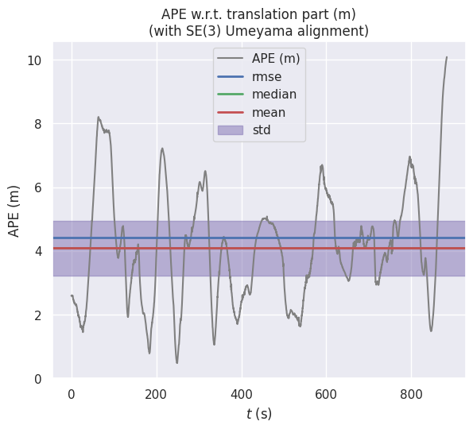

PCD Map:

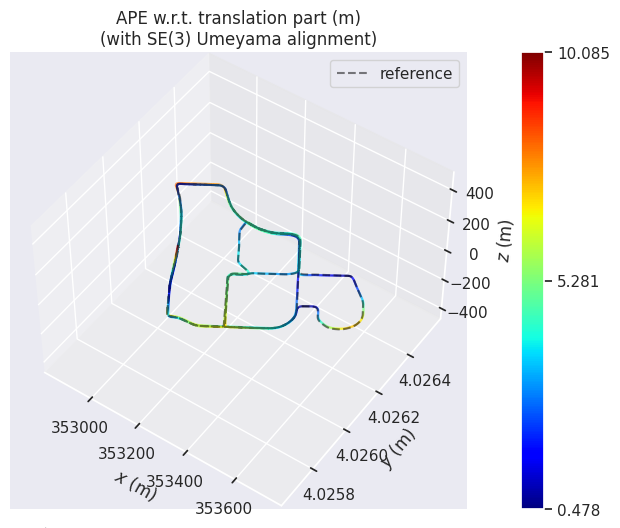

#### Interpolated
```bash
APE w.r.t. translation part (m)
(with SE(3) Umeyama alignment)

       max	10.039816
      mean	4.104697
    median	4.014570
       min	0.751020
      rmse	4.476316
       sse	1736801.802973
       std	1.785739
```

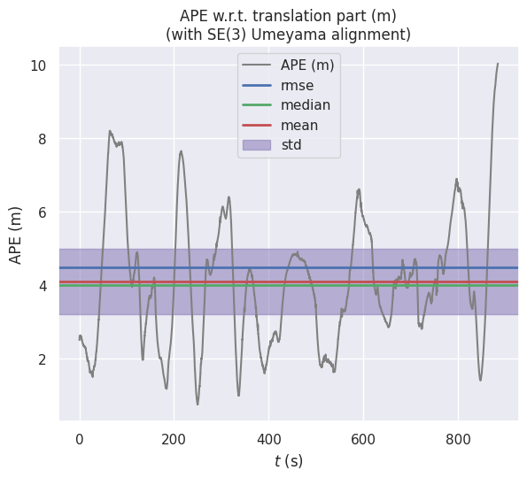

PCD Map:

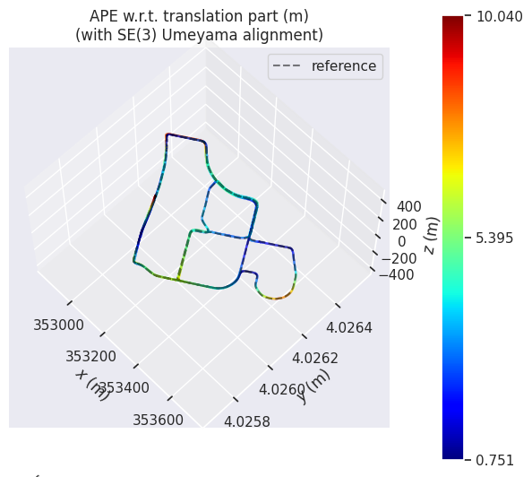

#### Fast-LIO2
```bash
APE w.r.t. translation part (m)
(with SE(3) Umeyama alignment)

       max	45.172713
      mean	17.345023
    median	13.342426
       min	3.415020
      rmse	20.227989
       sse	1036431.483299
       std	10.407772
```
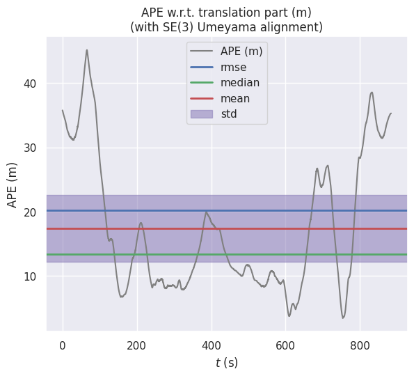

PCD Map:

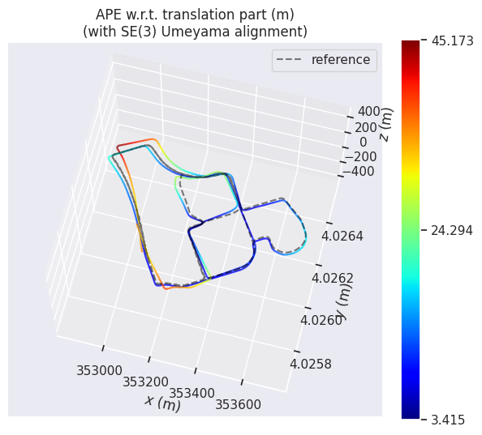


### RPE
#### Original
```bash
RPE w.r.t. translation part (m)
for delta = 1 (frames) using consecutive pairs
(with SE(3) Umeyama alignment)

       max	6.065881
      mean	4.710644
    median	4.685098
       min	1.943769
      rmse	4.743599
       sse	56974.387777
       std	0.558179
```

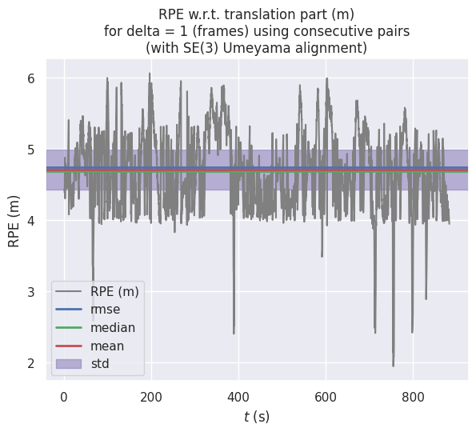

PCD Map:

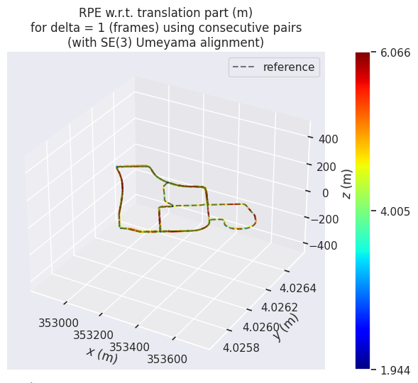

#### Interpolated
```bash
RPE w.r.t. translation part (m)
for delta = 1 (frames) using consecutive pairs
(with SE(3) Umeyama alignment)

       max	0.242106
      mean	0.137656
    median	0.139604
       min	0.016761
      rmse	0.143588
       sse	1787.055327
       std	0.040845
```

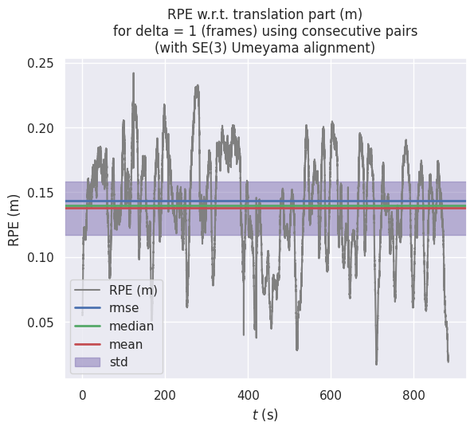

PCD Map:

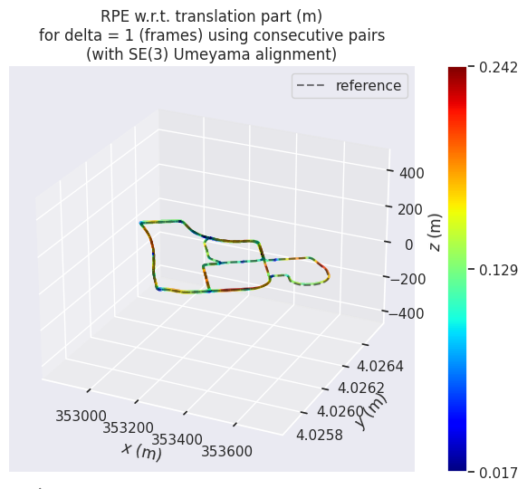

#### Fast-LIO2
```bash       
RPE w.r.t. translation part (m)
for delta = 1 (frames) using consecutive pairs
(with SE(3) Umeyama alignment)

       max	6.065953
      mean	4.710646
    median	4.685533
       min	1.943667
      rmse	4.743600
       sse	56974.410873
       std	0.558175
```


PCD Map:

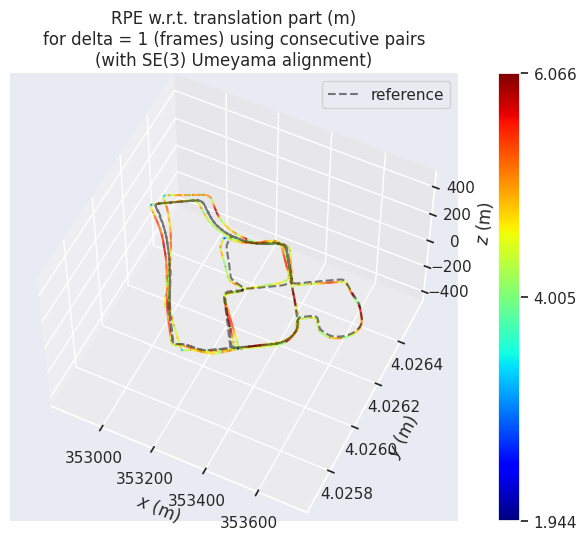